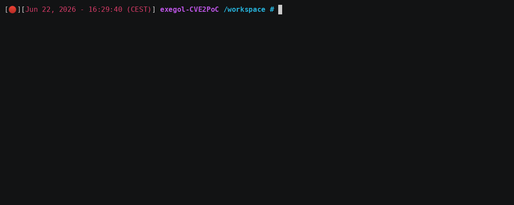
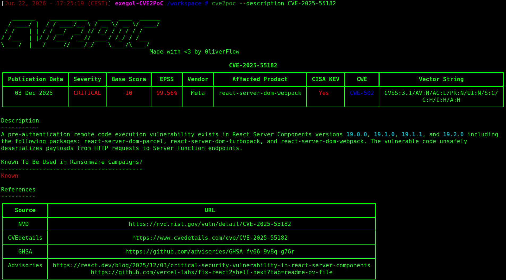
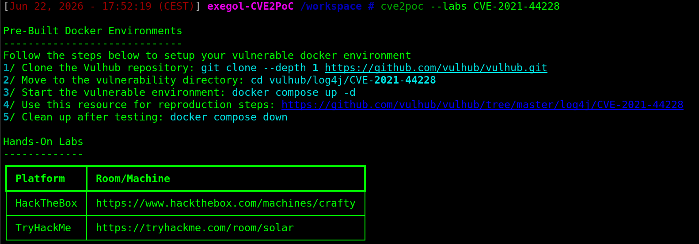
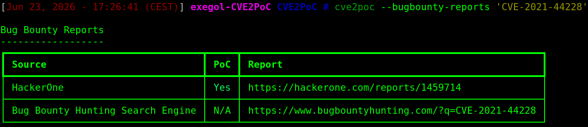
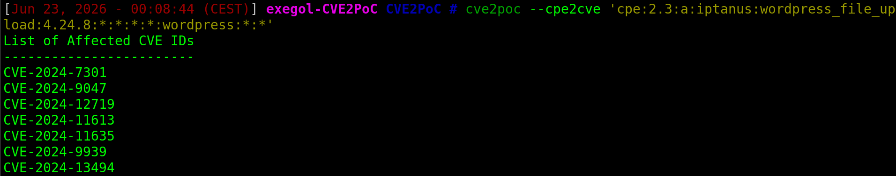
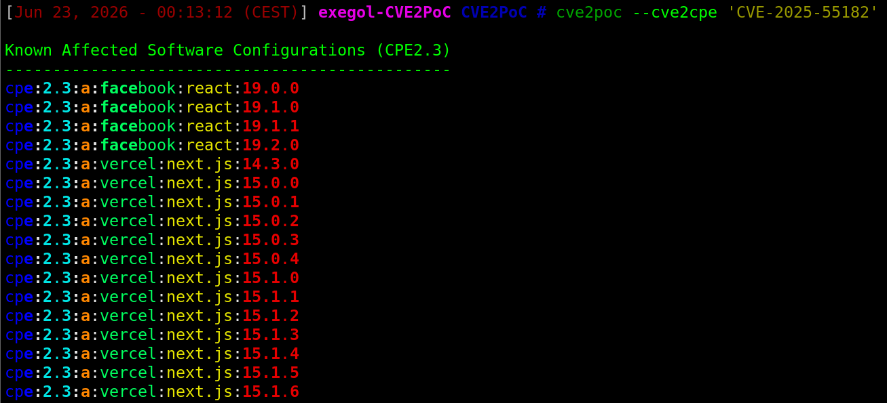
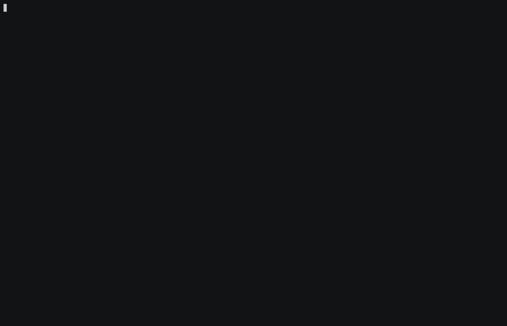
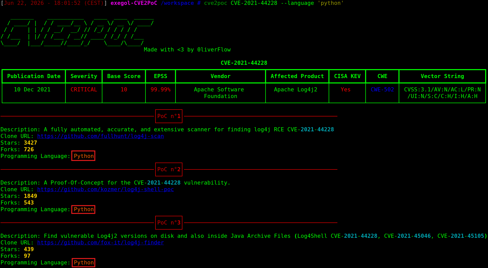
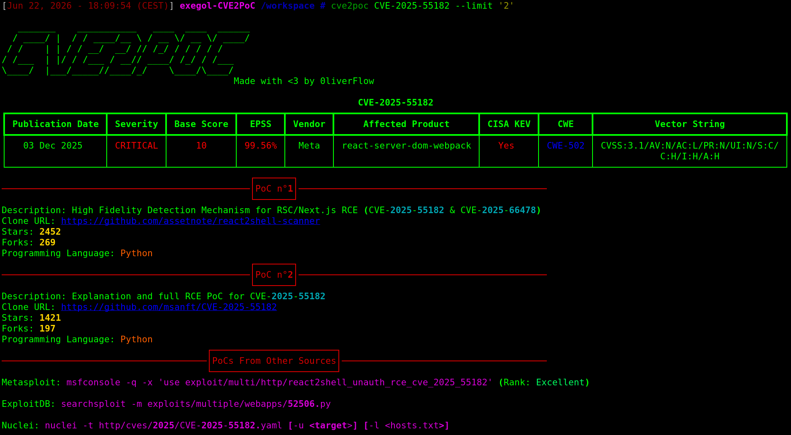

# CVE2PoC


  

CVE2PoC is a tool that helps penetration testers, bug hunters, and security researchers quickly find public exploits or Proof-of-Concepts (PoCs) related to a CVE ID.  

# Features

- 🔍**Public Exploits Aggregation:** Search and centralize public exploits from GitHub, Nuclei, ExploitDB and Metasploit
- 🐋**Isolated Testing Environments:** Docker-based environments for safe exploit testing
- 📊**CVE Intelligence:** Retrieve CVSS, CWE, EPSS, CISA KEV, Vector String
- 📢**Security Advisories:** Vendor advisories and GHSA references
- 📝**Report Generation:** Detailed technical report
- ✨**Ease of Use:** Simple setup and intuitive usage
- 🎯**Hands-on Labs:** HackTheBox and TryHackMe labs related to a CVE ID
- 🐞**Bug Bounty Reports:** Bug Bounty write-ups related to a CVE ID
- ↔️**CVE/CPE Mapping:** Retrieve CVEs related to a CPE and vice-versa

# Installation

CVE2PoC can be installed using `pipx` or `uv`.  

## Pipx

```bash
pipx install git+https://github.com/0liverFlow/cve2poc
```

## Uv

```bash
uv tool install git+https://github.com/0liverFlow/CVE2PoC
```

```bash
uvx git+https://github.com/0liverFlow/CVE2PoC
```


# Usage

CVE2PoC usage is straightforward. You can use it by simply specifying a CVE ID.  

Refer to the help menu and the demonstration section below to better understand the tool's features.  

```                                      
usage: cve2poc.py [-h] [-x] [-d] [-f FILE] [-o OUTPUT] [--cve2cpe CVE ID] [--cpe2cve CVE ID] [-s FILE] [--labs CVE ID]
                  [--bugbounty-reports CVE ID] [-l LANGUAGE] [--limit LIMIT] [-t] [--api-keys] [--no-banner]
                  [cve]

A simple yet powerful tool to quickly find PoCs related to a CVE ID

positional arguments:
  cve                               CVE ID

options:
  -h, --help                        show this help message and exit
  -x , --examine                    Examine an exploit's README file
  -d, --description                 Display a CVE ID description
  -f FILE, --file FILE              Specify a file containing a list of CVE IDs
  -o OUTPUT, --output OUTPUT        Output directory to store the reports
  --cve2cpe CVE ID                  Retrieve CPEs related to a CVE ID
  --cpe2cve CVE ID                  Retrieve CVEs related to a CPE
  -s FILE, --save FILE              Output file to save CPE2CVE results
  --labs CVE ID                     Search pre-built docker environments and CTFs related to a CVE ID
  --bugbounty-reports CVE ID        Search Bug Bounty reports related to a CVE ID
  -l LANGUAGE, --language LANGUAGE  Filter PoCs by programming language
  --limit LIMIT                     Number of PoCs to display
  -t , --threads                    Number of concurrent threads
  --api-keys                        Configure your GitHub and NVD API keys (Not required)
  --no-banner                       Remove banner
```


## Public Exploits Research

Run this command to search for public exploits related to a CVE ID:  

```bash
cve2poc <CVE ID>
```


> By default, the tool will return the **top 10 exploits**, sorted by their stars and forks.  
> Additionally, it will search for **Metasploit modules**, **Nuclei templates** and **Exploit-DB exploits** related to the specified CVE ID. 


## Report Generation

To search for multiple CVEs, specify a file containing a list of CVE IDs (one CVE per line) using the `-f` flag:  

```bash
cve2poc -f <file>
```




> By default, CVE2PoC automatically generates a detailed JSON and HTML reports in the current directory.  
> To use a different output directory, use the `-o` flag.  


## CVE Description

The command below returns a CVE ID description, as well as additional references to better understand the vulnerability:  

```bash
cve2poc --description <CVE ID>
```




## Vulnerable Docker Environment and Hands-on Labs

CVE2PoC can be used to find ready-to-use Docker environments and hands-on labs to safely understand and test exploits before using them in real-world environments, reducing the risk of production disruptions.  

```bash
cve2poc --labs <CVE ID>
```




## Bug Bounty Reports

Bug Bounty reports can be useful to better understand how a CVE was exploited in real life scenarios. They may also contain PoCs which can help you reproduce the vulnerability.  

```bash
cve2poc --bugbounty-reports <CVE ID>
```




## CPE to CVE IDs

To retrieve CVE IDs related to a CPE, run this command:  

```bash
cve2poc --cpe2cve <CPE>
```




## CVE ID to CPEs

To retrieve CPEs related to a CVE ID, run this command:  

```bash
cve2poc --cve2cpe <CVE ID>
```




## Examine an exploit documentation

CVE2PoC has a feature similar to `searchsploit -x`, that allows you to read the `README` file of an exploit directly from your terminal.  

This is handy especially if you need to have a quick understanding of how the exploit works without using your browser.  

To examine the exploit documentation, use this command:  

```bash
cve2poc --examine <GitHub Clone URL>
```




##  Filters

### Filter Public Exploits By Programming Language

CVE2PoC has a feature that can help you search for PoCs written in a specific programming language. To use it, run this command:  

```bash
cve2poc <CVE ID> --language <Programming Language>
```




### Limit The Number of Exploits to Display

By default, CVE2PoC returns the top 10 exploits found on GitHub. Nevertheless, you can display more or fewer exploits using the `--limit` flag:  

```bash
cve2poc <CVE ID> --limit <N>
```

  

> **N** must be greater than or equal to 1.  


# Post Installation Setup

CVE2PoC uses `argcomplete` to automatically perform tab completion via argparse.  

```bash
sudo apt install python3-argcomplete

# For Bash
register-python-argcomplete cve2poc >> ~/.bashrc
source ~/.bashrc

# For Zsh
register-python-argcomplete cve2poc >> ~/.zshrc
source ~/.zshrc
```


# Linting and Formating

CVE2PoC uses [ruff](https://docs.astral.sh/ruff/) for linting and formatting.  

```
# Run linter
uv run ruff check .

# Run linter with auto-fix
uv run ruff check --fix .

# Run formatter
uv run ruff format .
```


# Credits

A huge thanks to the following sources on which CVE2PoC relies on:  
- [National Vulnerability Database (NVD)](https://nvd.nist.gov/)
- [FIRST EPSS](https://www.first.org/)
- [CISA KEV](https://www.cisa.gov/known-exploited-vulnerabilities-catalog)
- [The CVE Program](https://www.cve.org/)
- [Nomi-sec ](https://github.com/nomi-sec/PoC-in-GitHub)
- [Trickest CVE](https://github.com/trickest/cve)
- [Vulhub](https://github.com/vulhub/vulhub)
- [GitHub Advisory Database (GHSA)](https://github.com/advisories)


# Disclaimer

This tool is intended for educational, research, and authorized security testing purposes only. Use it only on systems you own or have explicit permission to assess. The author is not responsible for any misuse or damage resulting from its use.
